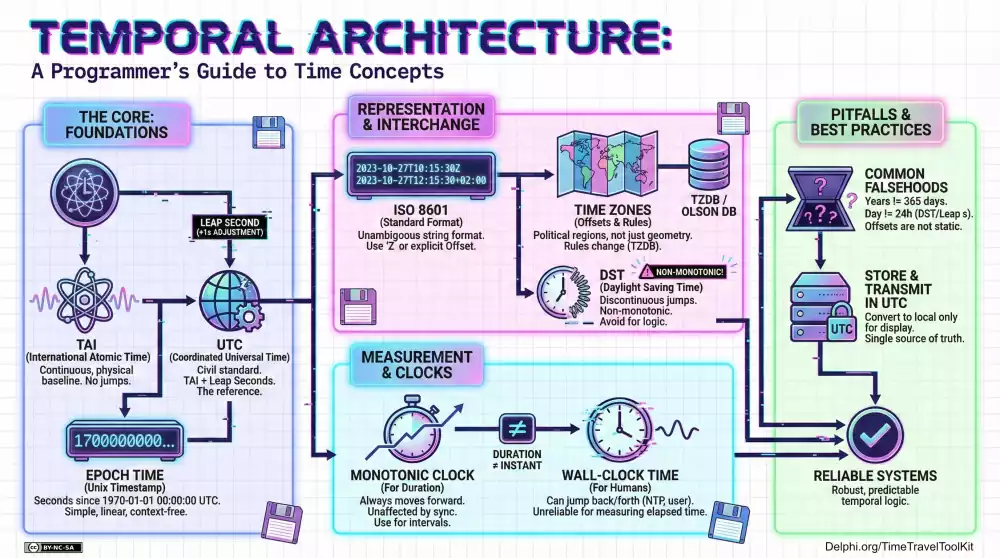

Here are some resources from my Time Traveller's Toolkit session from CodeRage 2025.

Click an infographic thumbnail to get the full quality infographic.

## Temporal Architecture

A programmer's guide to Time Concepts

## Pysics of Time

From Atoms to Orbits: Atomic Clocks and GPS Relativity

## Core Foundations

The Atomic to Civil Time Pipeline

## Escape the Now()

`Now()` is local time, but `TDateTime.NowUTC` is global time. Use UTC for storage and calculations to avoid time zone and daylight saving issues.

## Representation & Interchange

ISO 8601 and RFC 3339 are the standards for representing and exchanging date-time data in a clear, unambiguous format.

## Store User Intent, Not UTC

When scheduling events, store the user's local time and time zone instead of converting to UTC. This preserves the intended time across daylight saving changes and time zone shifts.

## Tale of Two Clocks

Monotonic clocks measure elapsed time without being affected by system clock changes, while wall clocks represent real-world time, which can jump forward or backward due to adjustments.

## TDateTime vs TTimeStamp

Both use 64-bits, but TTimeStamp has fixed accuracy for consistent, granular time calculations, while TDateTime's variable accuracy can lead to rounding errors in time arithmetic.

## Remote NTP Sync

Use NTP to synchronize system clocks with high-precision time servers, ensuring accurate timekeeping across distributed systems and applications.

## IANA TzDB

The IANA Time Zone Database (TzDB) is the authoritative source for global time zone information, including historical changes and daylight saving rules.

## Delphi TzDB vs IANA TzDB

The [Delphi TzDB](https://github.com/pavkam/tzdb) is the full implementation of the IANA TzDB, providing accurate and up-to-date time zone data for Delphi applications.

## Mastering Daylight Saving Time with the TzDB

Use the TzDB to handle daylight saving time transitions correctly, ensuring scheduled events occur at the intended local times.

## Delphi Timekeeper's Overview

The overview roadmap: legacy & foundational types, modern measurement & clocks, time zones & locationalize, and best practices.

